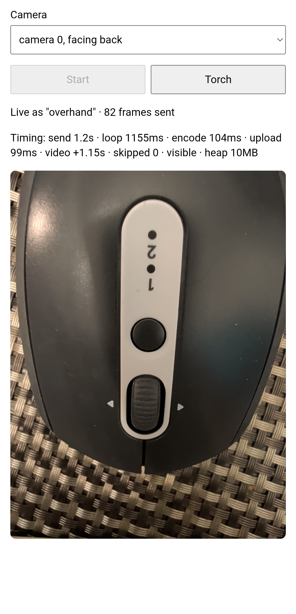
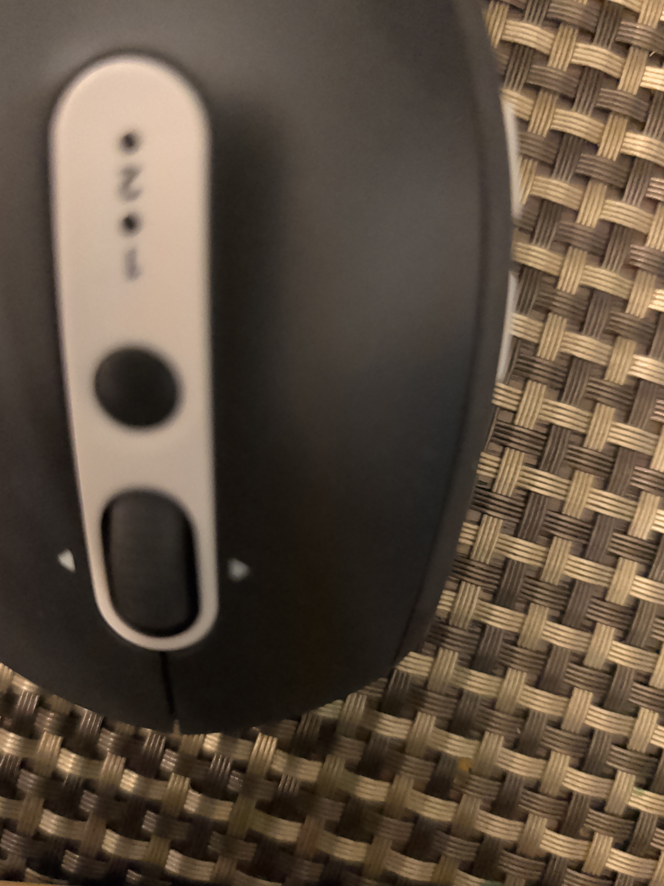

# Multicam

Talk, show, and document hands-on work with Codex and named phone cameras. Use a wide view for context and a close-up for labels, parts, or the step you are recording.

The desktop plugin bundles the camera service, runtime, and workflow instructions. Once installed, it starts automatically: no terminal, Python installation, or separate companion app is needed to use it. Your phone uses its existing browser.

## Get started in Codex

**Current availability:** Multicam is available for local plugin testing, but is not yet published in the public plugin directory. The Linux package has been tested; Windows/macOS packages and installation still need validation. A build ZIP is not a double-click installer. See [packaging and distribution status](docs/desktop-plugin.md).

If Multicam has been added to your local plugin marketplace:

1. Open the desktop app's **Plugins** directory, choose the marketplace containing **Multicam**, and install or enable it. For the personal setup, choose **Personal**. Restart the app if the local source has just been added and is not visible.
2. Start a **new local Codex conversation** and say or type **“Connect my phone camera.”**
3. Put your phone on the same Wi-Fi as the computer and scan the QR code. Enter the **separate PIN** shown on the computer within **60 seconds**. If it expires, say **“Open joining again.”**
4. The phone currently shows a self-signed certificate warning. Check that the address matches the computer's joining link before continuing. Allow camera access, name the view **workbench**, and tap **Start**.
5. Keep the phone page visible and say **“The camera is ready. Take a look.”** Codex requests a snapshot to check the view.

Repeat with another phone named **detail** for close-ups. If voice is available in your desktop conversation, use it; typing works too. See the [full plugin guide](plugins/multicam/README.md) for PIN retrieval, additional cameras, and troubleshooting.

## What you can do

Demonstrated workflows include two-camera capture, label reading, finger counting, and an item journal with saved photos.

| Use | Things to say |
| --- | --- |
| Journaling and inventory | “Add this item to my inventory, with a photo of its label.” |
| Reading labels | “Read the part number from detail.” |
| Step-by-step documentation | “Record this step with a photo and my notes.” |
| Repairs | “Look at workbench for context, then inspect the component in detail.” |
| Comparing progress | “Compare this with the photo from the previous step.” |

Tell Codex where to save your journal once. When you ask it to record an item or step, the workflow calls for a capture cue, a check that the photo shows the intended subject, and saving the photo with the note using available file tools. Codex confirms what was actually saved and says if image saving is unavailable.

Requested snapshots have been demonstrated. Continuous monitoring and precise measurement have not been validated. Focus, glare, lighting, and viewing angle affect label reading and visual comparisons.

  
  

*Left: an earlier Android phone page and its full-view preview. Right: an on-demand native still from the same scene. This test phone advertised 3064×4080; dimensions vary by device and camera.*

## Camera access and privacy

- The preview stays on the phone. Photos are sent only in response to a capture request; idle phones exchange request metadata, not background images.
- The phone page is reachable on the local network. New phones need a PIN during an open 60-second joining window. The QR code contains only the address, never the PIN.
- Paired phones need a session token, and each photo needs an expiring, single-use capture request. Already paired phones can answer snapshots after joining closes.
- Keep the phone page visible and awake. Use **Stop camera** on the phone or ask Codex to disconnect a named view when finished.
- Snapshots returned to the client are processed under that client's settings. Journal storage requires available file tools and an agreed destination.

The phone opens no camera-listening port. The desktop service uses HTTPS for phone connections, but accepting its self-signed certificate remains a trust limitation. The package has not undergone an independent security audit. Android Chrome has been tested; iOS Safari has not.

## Other cameras and developer setup

The underlying MCP server also supports webcams, USB cameras, RTSP and HLS streams, YouTube live streams, video files, RealSense cameras, Basler cameras, and other inputs supported by [framegrab](https://github.com/groundlight/framegrab).

- [Manual server setup, MCP tools, configuration, and development](docs/manual-setup.md)
- [Desktop plugin architecture and native package builds](docs/desktop-plugin.md)
- [STDIO compatibility for other MCP clients](docs/stdio-compatibility.md)

## Credits

multicam-mcp-server is a fork of [framegrab-mcp-server](https://github.com/groundlight/framegrab-mcp-server) by [Groundlight AI](https://www.groundlight.ai/), which provides the original MCP server and framegrabber tools. This fork renames the project and adds browser-based phone cameras. Both are licensed under Apache-2.0; see [LICENSE](LICENSE) and [NOTICE](NOTICE).

## Release work remaining

- Validate Windows/macOS installation and phone permissions.
- Complete public plugin distribution.
- Test phone cameras on iOS Safari.
