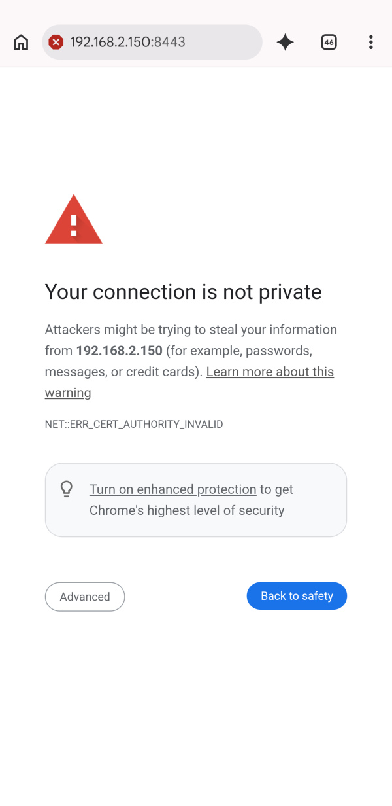

# multicam-mcp-server

Give Codex or another MCP client on-demand snapshots from several named cameras. Put a phone over each work area, connect an existing camera or stream, and ask for the view you need: `workbench`, `close-up`, or `meter`.

Phone cameras join from a browser—there is no phone app to install. The server also works with webcams, USB cameras, RTSP and HLS streams, YouTube live streams, video files, RealSense cameras, Basler cameras, and other inputs supported by [framegrab](https://github.com/groundlight/framegrab).

<p>
  
  
</p>

*Left: an earlier Android phone page and its full-view preview. Right: an on-demand native still from the same scene. This test phone advertised 3064×4080; dimensions vary by device and camera.*

## What you can do

Demonstrated workflows include two-camera capture, label reading, finger counting, and an item journal with saved photos. The main uses are journaling and inventory, reading labels, step-by-step documentation, and repairs combining a wide view with a close-up. Requested snapshots have been demonstrated; continuous monitoring and precise measurement have not been validated.

Use two or three stable camera names to make hands-on work easier:

| Project | Example views | Things to ask Codex |
|---|---|---|
| Electronics repair | `workbench`, `component`, `meter` | “Read the part marking in close-up,” “What does the meter show?”, or “Compare the board before and after this repair.” |
| Crafting | `workspace`, `detail`, `tool` | “Check this alignment,” “Identify the material label,” or “What should I do next?” |
| Painting | `wall`, `paint-label`, `tray` | “Which paint and shade is this?”, “Record this as the first coat,” or “Compare coverage after the second coat.” |

Image quality, focus, glare, and viewing angle still matter. A client interpreting a label, shade, or instrument reading should report uncertainty instead of guessing.

For a user-directed work journal, tell Codex where to save it, then say “record this step” when something matters. Codex can request the relevant snapshot, combine it with your comment, and later turn the selected material into a summary or illustrated instructions. Live help and later documentation can use the same named views.

> [!IMPORTANT]
> This server supplies named camera access and on-demand snapshots. You must explicitly ask or configure Codex to handle conversation, journaling, memory, file storage, or final documents. The server does not continuously record video, watch autonomously, decide when to capture, maintain or synchronize a project log, or create documentation by itself.

This project is in early development. Tools and behavior may change.

## ChatGPT Desktop plugin

The [Multicam plugin](plugins/multicam/README.md) bundles the camera runtime, a
voice workflow skill, QR setup, and spoken PIN retrieval. Native builds start a
shared local service automatically, without Python, a terminal, or a companion
app. See [packaging and current availability](docs/desktop-plugin.md): the Linux
runtime is tested, while Windows/macOS builds and public distribution still need
validation. The manual server setup below remains available for developers.

## Quick start: one shared server

The recommended Codex setup is one long-lived [Streamable HTTP](https://modelcontextprotocol.io/specification/2025-06-18/basic/transports#streamable-http) server. Every Codex task connects to the same process, so all clients share the camera registry, phone PIN, and phone HTTPS listener.

Install [uv](https://docs.astral.sh/uv/), then start the server:

```bash
ENABLE_FRAMEGRAB_PHONE_CAMERAS=true \
MULTICAM_MCP_TRANSPORT=streamable-http \
uvx --from git+https://github.com/itsariuk/multicam-mcp-server multicam-mcp-server
```

Keep this process running with your preferred service manager. By default, MCP listens only on `127.0.0.1:8000`; the separate phone-camera page listens on HTTPS port `8443` so phones on the local network can reach it.

Point Codex at the shared endpoint in `~/.codex/config.toml`:

```toml
[mcp_servers.multicam]
url = "http://127.0.0.1:8000/mcp"
```

Restart Codex or reload its MCP configuration. The first `uvx` start downloads dependencies and can take a while.

Leave out `ENABLE_FRAMEGRAB_PHONE_CAMERAS` if you only need cameras attached to the computer. Phone cameras are opt-in because they open an HTTPS port on the local network.

Clients that cannot connect to Streamable HTTP can still launch the server over STDIO. That compatibility mode is intended for one client; see [STDIO compatibility](docs/stdio-compatibility.md) for its setup and limitations.

## Add phone cameras

With `ENABLE_FRAMEGRAB_PHONE_CAMERAS=true`, the server provides a small phone page over HTTPS.

1. Ask the agent to add a phone camera. It calls `add_phone_camera`, opens a local page with a QR code and PIN, and returns the same joining information. If the page does not open, the agent can give you the link and PIN.
2. Put the phone on the same Wi-Fi as the computer and scan the QR code. Without a scanner, open `https://<computer-ip>:8443/` on the phone. Enter the PIN shown separately on the desktop: the QR code and link contain only the address.
3. Accept the browser's certificate warning. The server creates a self-signed certificate because browsers require HTTPS for camera access.

   
4. Allow camera access, enter a descriptive name such as `workbench`, and tap **Start**.
5. Prop the phone up, plug it into power, and repeat with any other views.

Names work like any other framegrabber. Ask the client to list cameras, grab one by name, or compare snapshots from several views.

### What happens on the phone

- The preview stays on the phone. While connected, the page checks for capture-request metadata every half-second; it does not encode or upload background preview images.
- `grab_frame` creates a random, single-use request ID, valid for eight seconds. The authenticated phone sees it and sends one photo. The server rejects unsolicited, expired, replayed, or wrong-camera responses before accepting an image body.
- Native `ImageCapture.takePhoto()` uses the maximum still dimensions advertised by the browser. Without it, the page captures the full uncropped video frame on request. The page prefers an uncropped 4080×3064 track; actual dimensions depend on the device.
- If the phone does not answer in time, the tool reports an error. There is no cached-preview fallback.
- Keep the page visible and the phone awake. Camera switching, torch, and wake lock are supported where the browser exposes them.

### Connection behavior

Joining is closed by default. Ask Codex to connect a phone to open a 60-second window, then enter the separately displayed PIN. If time runs out, ask Codex to open joining again; it creates a fresh PIN. Checking the PIN alone does not extend the window.

Already connected cameras continue to answer requested snapshots after joining closes. A reload or server restart that requires registration needs another open joining window. Reloading the phone page or restarting the server requires entering the current PIN again; credentials are kept only in memory. Releasing a camera stops its requests and cancels a pending capture.

If IP detection fails, Codex asks for the computer's Wi-Fi IPv4 address from Network Settings and passes it through `add_phone_camera(computer_ip=...)`. It must never guess an address or offer localhost as a phone URL.

### Security

Opening the phone page or scanning its QR code does not authorize a new phone. Joining requires the current PIN for new phones and an open 60-second window for every registration. The PIN changes whenever joining is reopened. A paired phone holds a random session token only in memory. Disconnecting the camera or restarting the server revokes it. Five wrong PINs from one address pause that address for one minute; ten wrong PINs across all addresses close the pairing window.

The HTTPS phone page is reachable by other devices on the local network. Viewing it grants no camera access. Requests and image uploads require a camera token; uploads additionally require the single-use capture request ID. There is no unauthenticated camera-image download endpoint. This controls accepted requests, not the ability of another network device to attempt connections.

The self-signed certificate is kept in the data directory described under [Configuration](#configuration). Pairing tokens are not persisted. The phone opens no listening port; it initiates HTTPS requests to the selected LAN address of the computer. The phone page blocks cross-origin browser requests and framing, restricts scripts with a content security policy, and disables caching of credentials and responses.

Frames travel from the phone to this server over HTTPS. The server does not upload them elsewhere, but the connected MCP client determines how returned snapshots are processed or stored. The phone shows a certificate warning the first time because the certificate is self-signed.

The self-signed certificate exception is a remaining trust-bootstrap limitation; this package is not independently audited or certified for high-security office deployments.

Phone cameras are tested with Chrome on Android. Safari on iOS has not been tested yet.

## Other cameras and streams

Ask the agent to create a framegrabber for a webcam, USB camera, RTSP URL, YouTube live stream, HLS stream, video file, RealSense camera, or Basler camera. It can then grab frames from that source by name.


*Screenshot from the original framegrab-mcp-server.*

### Autodiscovery (experimental)

Set `ENABLE_FRAMEGRAB_AUTO_DISCOVERY=true` to add webcams and USB cameras automatically at startup.

With autodiscovery enabled, `FRAMEGRAB_RTSP_AUTO_DISCOVERY_MODE` controls the RTSP search. The default is `off`; `complete_fast` performs a thorough search but makes startup slower.

## MCP interface

### Tools

| Tool | What it does |
|---|---|
| `create_framegrabber` | Create a named framegrabber from a framegrab configuration object. |
| `grab_frame` | Grab a frame and return it as `png`, `jpg`, or `webp` (`webp` by default). |
| `list_framegrabbers` | List every available named framegrabber, including phones. |
| `get_framegrabber_config` | Return a framegrabber's configuration. |
| `set_config` | Update a framegrabber's configuration options. Phone cameras have no configurable options. |
| `release_grabber` | Release and remove a framegrabber. |
| `add_phone_camera` | Return the link, separate PIN, and URL-only QR code; open the local setup page. Use `open_browser=false` to skip opening it, or `computer_ip` with the user-provided Wi-Fi IPv4 address if detection fails. |
| `get_phone_connection_info` | Retrieve the current URL, joining link, PIN, and digit-by-digit PIN text without opening a browser. |

### Resources

- `fg://framegrabbers` lists all available framegrabbers by name.

## Configuration

All settings are environment variables.

| Variable | Default | Meaning |
|---|---|---|
| `ENABLE_FRAMEGRAB_PHONE_CAMERAS` | `false` | Serve the phone-camera page. |
| `FRAMEGRAB_PHONE_CAMERAS_PORT` | `8443` | HTTPS port for phones. If occupied, phone cameras are disabled for that process while other sources remain available. |
| `ENABLE_FRAMEGRAB_AUTO_DISCOVERY` | `false` | Discover webcams and USB cameras at startup. |
| `FRAMEGRAB_RTSP_AUTO_DISCOVERY_MODE` | `off` | RTSP discovery mode: `off`, `ip_only`, `light`, `complete_fast`, or `complete_slow`. |
| `MULTICAM_MCP_TRANSPORT` | `stdio` | MCP transport. Set `streamable-http` for a shared long-lived server. |
| `MULTICAM_MCP_HOST` | `127.0.0.1` | MCP listen address in Streamable HTTP mode. |
| `MULTICAM_MCP_PORT` | `8000` | MCP listen port in Streamable HTTP mode. |

The certificate and private joining page are stored in the user data directory—on Linux, `~/.local/share/multicam-mcp-server/`.

## Development

The package uses Python 3.10 or newer and `mcp[cli]>=2.2,<3`.

```bash
uv sync --extra dev
uv run pytest -q                 # tests
make mcp-inspector               # try the tools in the MCP inspector
make run-server                  # run the server over STDIO
make build                       # build the wheel
```

The phone camera server lives in `multicam_mcp_phone.py`, its page is `multicam_mcp_phone.html`, and `multicam_mcp_server.py` contains the MCP tools.

## Credits

multicam-mcp-server is a fork of [framegrab-mcp-server](https://github.com/groundlight/framegrab-mcp-server) by [Groundlight AI](https://www.groundlight.ai/), which provides the original MCP server and framegrabber tools. This fork renames the project and adds browser-based phone cameras. Both are licensed under Apache-2.0; see [LICENSE](LICENSE) and [NOTICE](NOTICE).

## Roadmap

- Test phone cameras on iOS Safari.
