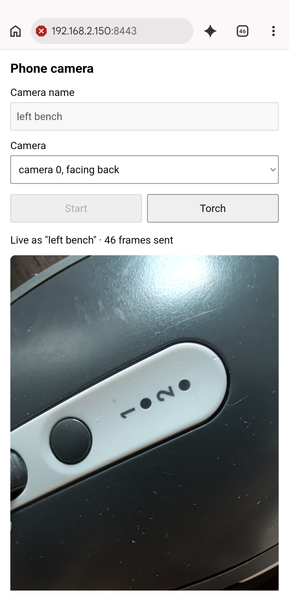
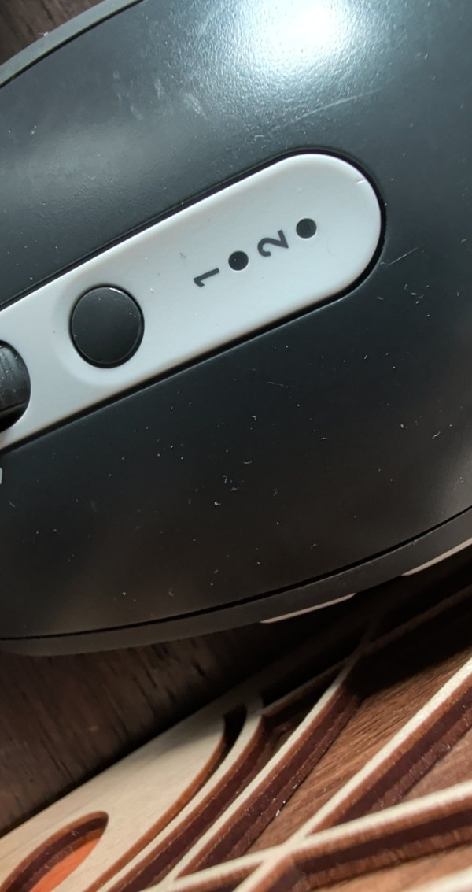

# multicam-mcp-server

A Model Context Protocol (MCP) server that lets an AI agent look through several cameras at once. Put a phone on each workbench, give each one a name, and ask your agent to "look at the left bench". It also captures from webcams, USB cameras, RTSP streams, YouTube live streams, and anything else the [framegrab](https://github.com/groundlight/framegrab) library supports.

Phones join from their browser. There is no app to install.

<p>
  
  
</p>

*Left: the page on the phone. Right: what the agent got back from `grab_frame("left bench")` at the same moment (full size is 2160×4080).*

### Credits
multicam-mcp-server is a fork of [framegrab-mcp-server](https://github.com/groundlight/framegrab-mcp-server) by [Groundlight AI](https://www.groundlight.ai/), which provides the MCP server and all of the framegrabber tools. This fork renames the project and adds phone browser cameras. Both are licensed under Apache-2.0; see [LICENSE](LICENSE) and [NOTICE](NOTICE).

This project is in early development. Tools and behaviour may change.

## Quick start

The server runs over stdio and is started by your MCP client. You need [uv](https://docs.astral.sh/uv/). The first start downloads the dependencies and can take a while.

### Codex
```bash
codex mcp add multicam --env ENABLE_FRAMEGRAB_PHONE_CAMERAS=true -- \
  uvx --from git+https://github.com/itsariuk/multicam-mcp-server multicam-mcp-server
```

Or in `~/.codex/config.toml`:
```toml
[mcp_servers.multicam]
command = "uvx"
args = ["--from", "git+https://github.com/itsariuk/multicam-mcp-server", "multicam-mcp-server"]

[mcp_servers.multicam.env]
ENABLE_FRAMEGRAB_PHONE_CAMERAS = "true"
```

### Claude Desktop
Add this to your `claude_desktop_config.json`:
```json
{
  "mcpServers": {
    "multicam": {
      "command": "uvx",
      "args": [
        "--from",
        "git+https://github.com/itsariuk/multicam-mcp-server",
        "multicam-mcp-server"
      ],
      "env": {
        "ENABLE_FRAMEGRAB_PHONE_CAMERAS": "true"
      }
    }
  }
}
```

### Zed
Add this to your Zed `settings.json`:
```json
{
  "context_servers": {
    "multicam": {
      "command": {
        "path": "uvx",
        "args": [
          "--from",
          "git+https://github.com/itsariuk/multicam-mcp-server",
          "multicam-mcp-server"
        ]
      }
    }
  }
}
```

Leave out `ENABLE_FRAMEGRAB_PHONE_CAMERAS` if you only want cameras attached to the computer. Phone cameras are off unless you turn them on, because they open a port on your network. See [Security](#security).

## Phone cameras (experimental)

With `ENABLE_FRAMEGRAB_PHONE_CAMERAS="true"`, the server also serves a small web page over HTTPS on port 8443.

1. Ask the agent to add a phone camera. It calls the `add_phone_camera` tool, which opens a page on the computer with a QR code and a PIN, and tells the agent both. If the page does not open, the agent can read you the link and the PIN.
2. Put the phone on the same Wi-Fi as the computer and scan the QR code with its camera. The PIN arrives with it. Without a scanner, open `https://<your-computer's-ip>:8443/` on the phone and type the PIN.
3. Accept the browser's certificate warning. The server makes its own self-signed certificate, because browsers only allow camera access over HTTPS. You do this once per phone. It will ask again if your computer's IP address changes.
4. Allow camera access, type a name such as `left bench`, and tap **Start**.
5. Prop the phone up and plug it into a charger.

The name now works like any other framegrabber. Ask the agent to list cameras or to look at `left bench`. Repeat on more phones with different names.

What to expect:

| Situation | What happens |
|-----------|--------------|
| Agent calls `grab_frame` | It gets the latest frame. The phone sends one full-resolution frame per second. |
| Agent calls `release_grabber` | The page stops sending and says so. Tap **Start** to rejoin. |
| The MCP client restarts the server | The page reconnects by itself under the same name. You don't need to touch the phone. |
| The page is closed or in the background, the phone sleeps, or another app takes the camera | The page stops sending, and `grab_frame` returns an error saying how long ago the last frame arrived, not an old image. Sending resumes by itself when the page is back on screen. |
| The page is open in two tabs | Only one tab can use the camera. The second tab tells you after a few seconds. |
| A name is already used by a USB or RTSP camera | The page shows an error. Pick another name. |
| The phone asks for the PIN again | Its token is no longer valid, for example after the data directory was deleted. Ask the agent for the current PIN. |

On the page you can switch between the front and back camera. Where the browser supports it, you can also turn on the torch. The page asks the phone to keep the screen on while it is live.

### Security
Joining needs the PIN shown on the computer, so only someone who can see that screen can add a camera or take over an existing name. The PIN changes every time the server starts. After a phone has joined, it keeps a token for its camera name, so reloading the page or restarting the server does not ask for the PIN again. Five wrong PINs from one address pause that address for a minute.

The token key and the certificate are kept in the data directory (see [Configuration](#configuration)). Delete that directory to sign every phone out.

Frames are encrypted on the way from the phone to your computer and go nowhere else. The certificate is self-signed, which is why the phone shows a warning the first time.

### Tested with
Chrome on Android. Safari on iOS has not been tested yet.

## Cameras and streams on the computer

Ask the agent to create a framegrabber for a webcam, a USB camera, an RTSP URL, a YouTube live stream, an HLS stream, a video file, a RealSense camera, or a Basler camera. It then grabs frames from it by name.


*Screenshot from the original framegrab-mcp-server.*

### (experimental) Autodiscovery
Set `ENABLE_FRAMEGRAB_AUTO_DISCOVERY="true"` to add webcams and USB cameras automatically at startup.

With autodiscovery on, `FRAMEGRAB_RTSP_AUTO_DISCOVERY_MODE` controls the search for RTSP cameras. The default is `"off"`. For a thorough search, use `"complete_fast"`. This makes the server slower to start.

## Tools

| Tool | What it does |
|------|--------------|
| `create_framegrabber` | Create a framegrabber from a configuration object and add it to the available grabbers. |
| `grab_frame` | Grab a frame from a framegrabber and return it as an image (`png`, `jpg`, or `webp`). |
| `list_framegrabbers` | List all available framegrabbers by name, including phone cameras. |
| `get_framegrabber_config` | Return the configuration of a framegrabber. |
| `set_config` | Update the configuration options of a framegrabber. Phone cameras have no options. |
| `release_grabber` | Release a framegrabber and remove it from the available grabbers. |
| `add_phone_camera` | Return the link, the PIN and a QR code for joining a phone, and open a page showing them on this computer (`open_browser=false` skips that). |

### Resources
- `fg://framegrabbers`: all available framegrabbers by name.

## Configuration

All settings are environment variables.

| Variable | Default | Meaning |
|----------|---------|---------|
| `ENABLE_FRAMEGRAB_PHONE_CAMERAS` | `false` | Serve the phone camera page. |
| `FRAMEGRAB_PHONE_CAMERAS_PORT` | `8443` | HTTPS port for the phone camera page. If the port is taken, phone cameras are turned off for that run and the rest of the server works as usual. |
| `ENABLE_FRAMEGRAB_AUTO_DISCOVERY` | `false` | Discover webcams and USB cameras at startup. |
| `FRAMEGRAB_RTSP_AUTO_DISCOVERY_MODE` | `off` | One of `off`, `ip_only`, `light`, `complete_fast`, `complete_slow`. |

The self-signed certificate, the token key and the join page are kept in your user data directory (on Linux, `~/.local/share/multicam-mcp-server/`). Delete that directory to make a new certificate and sign every phone out.

## Development

```bash
uv sync --extra dev
uv run pytest -q                 # tests
make mcp-inspector               # try the tools in the MCP inspector
make run-server                  # run the server over stdio
make build                       # build the wheel
```

The phone camera server lives in `multicam_mcp_phone.py`, and the page is `multicam_mcp_phone.html`. `multicam_mcp_server.py` holds the MCP tools.

## Roadmap
- Full-resolution capture on demand, with a smaller preview the rest of the time.
- Testing on iOS Safari.
